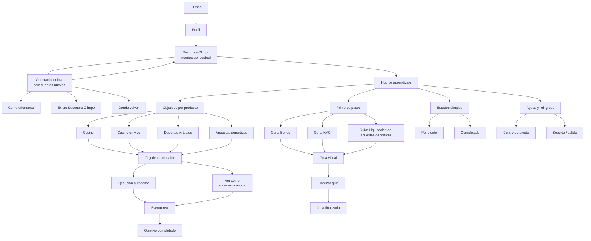
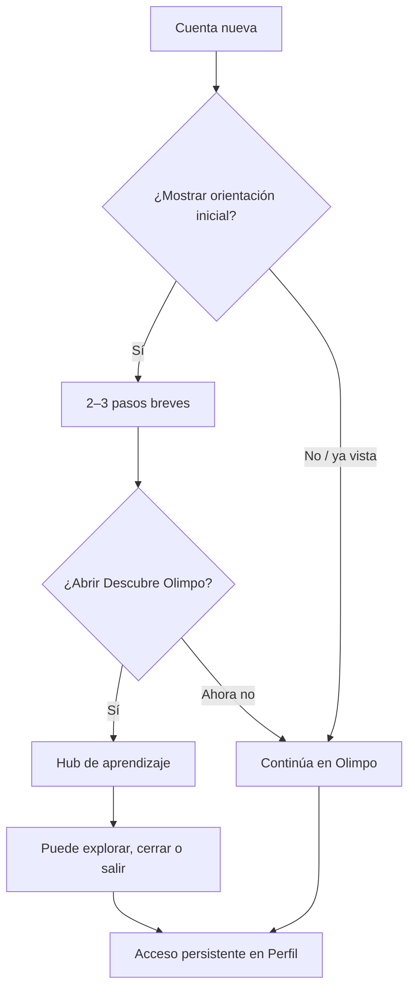
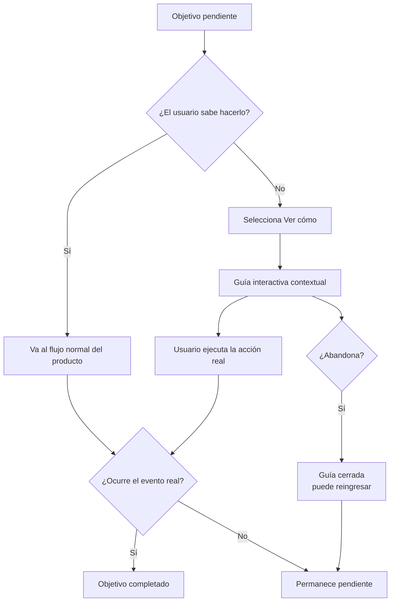
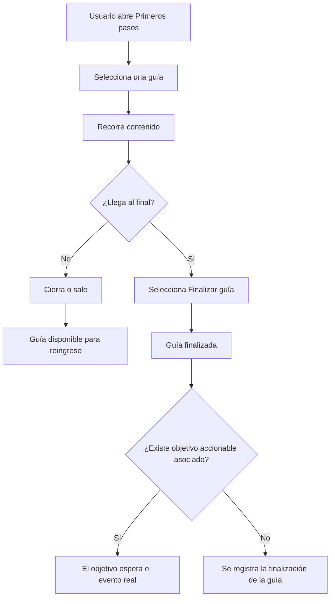
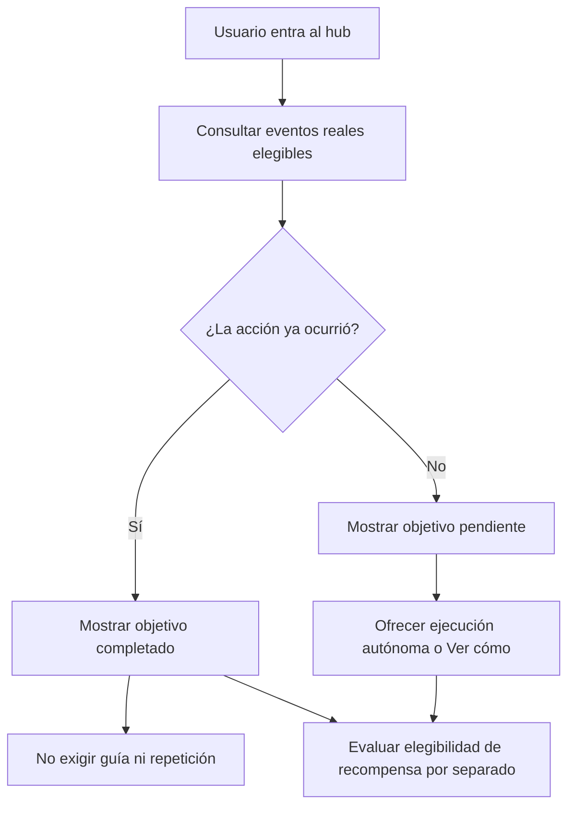

# Fases del onboarding y arquitectura de contenido

## Estado

Propuesta de trabajo para convertir los pendientes de “fasear el onboarding” y “armar el árbol de contenido y casos de uso” en una base para el MVP, el flujograma y el trabajo posterior de UX/UI.

Esta propuesta consolida decisiones ya vigentes, pero no cierra los pendientes de Producto, Negocio o Compliance. En particular, la matriz exacta de objetivos, eventos reales, elegibilidad y montos de Libras sigue abierta.

## Principios que no cambian entre fases

- `Descubre Olimpo` es el nombre conceptual de trabajo; no es naming definitivo.
- El MVP está disponible para todos y muestra desde el inicio todos los objetivos definidos para ese MVP.
- El aprendizaje posterior al primer ingreso es opcional. La orientación inicial solo enseña cómo orientarse, que existe el espacio y dónde volver a encontrarlo.
- El objetivo define **qué**, la guía explica **cómo** y la acción real determina el progreso.
- Una guía visual puede finalizarse al recorrer y confirmar su contenido; un objetivo accionable solo se completa por su evento real instrumentado.
- `guia_finalizada` no equivale a `objetivo_completado`.
- Las recompensas acompañan el aprendizaje; no deben convertirse en incentivo de intensidad de juego.
- La interfaz debe diferenciarse de Misiones y Rachas y no bloquear depósito, retiro, autoexclusión ni controles de juego responsable.

## Fases de evolución

### Fase 1 — MVP: orientar, descubrir y aprender bajo demanda

**Propósito:** entregar el primer sistema navegable y medible de descubrimiento y aprendizaje progresivo.

**Incluye**

- Un punto de entrada persistente dentro del perfil: `Descubre Olimpo`.
- Una orientación inicial breve, de 2–3 pasos y una sola vez para cuentas nuevas.
- Un hub accesible bajo demanda, con objetivos pendientes y completados.
- Disponibilidad para todos, sin segmentación inicial.
- La ruta `Primeros pasos` con las tres guías visuales ya priorizadas:
  - `Conoce cómo funcionan los bonos`.
  - `Verifica tu identidad`.
  - `Conoce cómo validamos las apuestas deportivas`.
- Categorías iniciales para los cuatro productos: Casino, Casino en vivo, Deportes virtuales y Apuestas deportivas.
- Dos estados simples de objetivo: pendiente o completado; sin mostrar progreso parcial tipo “4 de 10”.
- En objetivos accionables, dos caminos equivalentes: ejecución autónoma o acceso a ayuda mediante `Ver cómo` cuando la guía exista.
- Instrumentación base del recorrido: visualización, inicio, pasos, cierre, finalización de guía, finalización del objetivo y fuente de finalización.
- Enlace de salida y reingreso sin penalización por abandonar una guía.

**No incluye todavía**

- Segmentación o recomendaciones personalizadas.
- Ordenamiento adaptativo por comportamiento.
- Notificaciones de nuevos objetivos.
- Promesas de montos, elegibilidad o retroactividad de Libras.
- Objetivos considerados definitivos sin haber definido su evento real y su riesgo de interpretación como incentivo.

**Criterio de salida del MVP**

El sistema permite entrar, entender la diferencia entre guía y objetivo, completar una guía visual dentro de su recorrido y reconocer la finalización de un objetivo accionable mediante un evento real. Además, permite medir dónde se descubre, dónde se abandona y cuándo se necesita ayuda.

### Fase 2 — Ayuda contextual y cobertura de fricciones prioritarias

**Propósito:** llevar la ayuda desde el hub hacia los momentos concretos de intención o fricción.

**Evoluciona el MVP con**

- Entradas contextuales a objetivos o guías desde las superficies de producto donde la acción tiene sentido.
- `Ver cómo` conectado al destino correcto, con guía interactiva sobre la interfaz real cuando la acción lo requiera.
- Más objetivos solo cuando exista una brecha comprobada de descubrimiento, comprensión o ejecución.
- Estados de ayuda y recuperación: guía disponible, guía no aplicable, acción ya completada, elemento no visible y fallback a Centro de ayuda o soporte.
- Comunicación de nuevas oportunidades de aprendizaje en puntos de entrada que Producto valide; no asumir todavía un canal concreto.
- Medición de utilidad y claridad posterior a la guía mediante muestreo ligero.
- Revisión de la relación entre necesidad de guía y fricción del producto: una alta finalización guiada puede revelar una oportunidad de mejorar el flujo original.

**Guardrails de esta fase**

- No convertir cada superficie en un tooltip o una cadena de interrupciones.
- No usar una guía para explicar UI obvia ni forzar pasos que el usuario puede ejecutar directamente.
- No premiar directamente monto, frecuencia, duración o intensidad de juego.
- Mantener visible el cierre, el reingreso y las rutas de ayuda responsable.

**Criterio de salida de la fase 2**

Las ayudas aparecen en momentos relevantes, pueden recuperarse sin perder el contexto y permiten distinguir si la fricción proviene de falta de conocimiento o de un problema del producto. La cobertura adicional se justifica con evidencia y no solo con cantidad de objetivos.

### Fase 3 — Adaptación y sistema de aprendizaje maduro

**Propósito:** adaptar la experiencia sin convertirla en una mecánica de presión ni en una nueva versión de Misiones.

**Evoluciona el sistema con**

- Priorización de objetivos según comportamiento observado, productos ya conocidos y señales de necesidad de ayuda.
- Recomendaciones o secuencias de aprendizaje contextual, siempre opcionales.
- Segmentación progresiva solo después de validar la utilidad, la instrumentación y los criterios de privacidad/compliance.
- Experimentación controlada de copy, punto de entrada, tipo de guía y orden de contenido.
- Reglas de supresión: no mostrar una guía cuando el objetivo ya está completado, cuando la ayuda no es pertinente o cuando una intervención puede interrumpir una tarea crítica.
- Evolución del sistema de contenidos para que Producto pueda agregar, retirar o versionar objetivos sin romper el modelo de progreso.
- Paneles de lectura para distinguir descubrimiento, comprensión, ejecución autónoma, ejecución guiada, abandono y soporte.

**No debe convertirse en**

- Un feed infinito de promociones.
- Un sistema que optimice apuestas, depósitos, frecuencia o duración de sesión.
- Una obligación de consumir tutoriales.
- Una copia semántica de Misiones o Rachas.

**Criterio de salida de la fase 3**

La adaptación demuestra mayor relevancia y autonomía sin aumentar la presión de juego, y el sistema puede mantenerse con reglas de contenido, instrumentación y revisión claramente gobernadas.

## Árbol de contenido

El árbol separa el espacio de aprendizaje, la orientación, los objetivos accionables y las guías visuales. La estructura no implica que todos los objetivos ni todos los eventos estén aprobados.

### Reglas del árbol

- `Primeros pasos` es una ruta de guías visuales; no se nombra como Misión.
- Las categorías de producto son contenedores de objetivos, no afirmaciones de que todos ya estén definidos.
- `Ver cómo` es una entrada de ayuda, no una condición de finalización.
- `Finalizar guía` marca la guía como recorrida; solo el evento real completa un objetivo accionable.
- `Pendiente` y `Completado` son los estados visibles iniciales. La elegibilidad de recompensa se evalúa aparte.
- Si el usuario ya realizó la acción, el sistema debe reconocer el objetivo como completado sin obligarlo a repetirla ni a abrir una guía.

## Casos de uso prioritarios

| ID | Actor y situación | Necesidad | Camino esperado | Resultado / medición |
|---|---|---|---|---|
| CU-01 | Cuenta nueva entra por primera vez | Entender dónde está y dónde pedir ayuda | Orientación breve → `Descubre Olimpo` → cierre o navegación normal | `learning_hub_viewed`; no obliga a consumir guías |
| CU-02 | Usuario no conoce el espacio | Descubrir que existe | Perfil → `Descubre Olimpo` | `objective_viewed`; reingreso disponible |
| CU-03 | Usuario quiere aprender bonos | Entender dónde encontrarlos, revisar condiciones y activarlos | `Primeros pasos` → guía de Bonos → `Finalizar guía` | `guide_completed`; no completa un objetivo accionable por sí sola |
| CU-04 | Usuario necesita entender KYC | Saber qué preparar y qué esperar | `Primeros pasos` → guía de KYC → salida a ayuda si hace falta | `guide_completed`; contenido sujeto a validación de flujo |
| CU-05 | Usuario quiere entender una liquidación deportiva | Reducir incertidumbre sobre fuentes, reglas, vivo y correcciones | `Primeros pasos` → guía de liquidación → detalle / reglamento / ayuda | `guide_completed`; no afirmar un proveedor único |
| CU-06 | Usuario ya realizó una acción | No repetir una acción ni ver un objetivo desactualizado | Entrada al hub → objetivo reconocido como completado | `objective_completion_source=autónoma` si aplica; elegibilidad separada |
| CU-07 | Usuario sabe qué hacer y no necesita guía | Completar el objetivo sin pasar por el hub | Flujo normal del producto → evento real | `objective_completed`; fuente autónoma |
| CU-08 | Usuario no sabe qué hacer | Recibir acompañamiento en contexto | Objetivo → `Ver cómo` → guía interactiva → acción real | `guide_started` + evento real; fuente guiada |
| CU-09 | Usuario abandona una guía | Salir sin penalización y poder retomarla | Cerrar / Escape → vuelve al hub o producto | `guide_dismissed`; objetivo permanece pendiente salvo evento real |
| CU-10 | Objetivo no es aplicable o cambió la interfaz | No quedar bloqueado | Fallback a Centro de ayuda / soporte | Error y fallback instrumentados; no marcar completado |
| CU-11 | Usuario consulta un objetivo completado | Confirmar qué aprendió o hizo | Hub → estado `Completado` → detalle opcional | `objective_viewed`; no reinicia como Racha |
| CU-12 | Producto incorpora un objetivo futuro | Ampliar aprendizaje con control | Definir valor, brecha, evento, guía, elegibilidad y riesgo → publicar | Requiere validación antes de entrar al sistema |

## Flujogramas operativos

### Primer ingreso

### Objetivo accionable: camino autónomo o guiado

### Guía visual de `Primeros pasos`

### Reconocimiento de comportamiento previo

## Matriz mínima para definir cada objetivo antes de implementarlo

| Campo | Pregunta que debe responderse |
|---|---|
| Producto / superficie | ¿Dónde vive la capacidad? |
| Objetivo | ¿Qué debe poder hacer o comprender el usuario? |
| Valor | ¿Por qué vale la pena incluirlo? |
| Brecha | ¿Es una brecha de descubrimiento, comprensión o ejecución? |
| Tipo | ¿Es guía visual o objetivo accionable? |
| Ayuda | ¿Requiere contenido estático, contextual o guía interactiva? |
| Evento real | ¿Qué evento instrumentado lo completa? |
| Fuente de finalización | ¿Cómo se distingue autónoma de guiada? |
| Estado previo | ¿Cómo se reconoce si la acción ya ocurrió? |
| Recompensa | ¿Corresponde mostrar “Libras por definir” o ninguna recompensa? |
| Elegibilidad | ¿Está validada por Producto, Negocio y Compliance? |
| Riesgo | ¿Puede interpretarse como incentivo de intensidad de juego? |
| Fallback | ¿Qué ocurre si el elemento, ruta o condición no está disponible? |

## Pendientes de decisión

- Confirmar la lista exacta de objetivos accionables del MVP y sus eventos reales.
- Confirmar si `Primeros pasos` entrega una recompensa por ruta completa y bajo qué elegibilidad; no mostrar monto hasta validación.
- Definir qué productos tendrán objetivo accionable en el MVP y cuáles solo estarán representados como categorías.
- Resolver la ubicación definitiva del acceso en móvil y escritorio.
- Mapear los flujos reales de KYC, bonos y detalle de liquidación antes de convertir las guías en contenido publicable.
- Validar naming de `Descubre Olimpo`, `Primeros pasos`, `Ver cómo` y los estados visibles.
- Definir criterios de privacidad, consentimiento, segmentación y revisión de Compliance para la fase 3.

## Referencias vigentes

- [Fundamentos del proyecto](../foundations/project-context.md)
- [Auditoría de contenido](../content-audit/README.md)
- [Prototipo de Inicio](../experience/home-prototype.md)
- [Sistema visual observado](../design-system/README.md)
